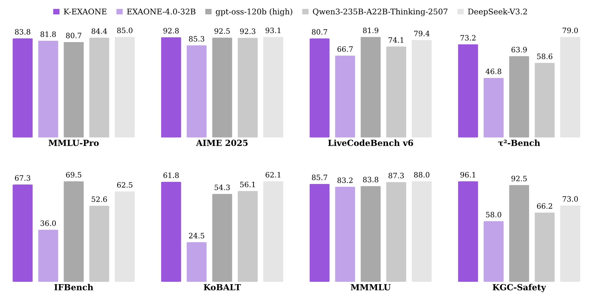

<br>
<br>
<p align="center">

<br>
<br>
<br>

<div align="center">
  <a href="https://huggingface.co/collections/LGAI-EXAONE/k-exaone" style="text-decoration: none;">
    
  </a>
  <a href="#" style="text-decoration: none;">
    
  </a>
  <a href="https://www.lgresearch.ai/data/cdn/upload/K-EXAONE_Technical_Report.pdf" style="text-decoration: none;">
    
  </a>
  <a href="https://github.com/LG-AI-EXAONE/K-EXAONE" style="text-decoration: none;">
    
  </a>
  <a href="https://friendli.ai/model/LGAI-EXAONE/K-EXAONE-236B-A23B" style="text-decoration: none;">
    
  </a>
</div>

<br>

<br><br>

We introduce **K-EXAONE**, a large-scale multilingual language model developed by LG AI Research. Built using a Mixture-of-Experts architecture, K-EXAONE features **236 billion total** parameters, with **23 billion active** during inference. Performance evaluations across various benchmarks demonstrate that K-EXAONE excels in reasoning, agentic capabilities, general knowledge, multilingual understanding, and long-context processing.

### Key Features

- **Architecture & Efficiency:** Features a 236B fine-grained MoE design (23B active) optimized with **Multi-Token Prediction (MTP)**, enabling self-speculative decoding that boosts inference throughput by approximately 1.5x.
- **Long-Context Capabilities:** Natively supports a **256K context window**, utilizing a **3:1 hybrid attention** scheme with a **128-token sliding window** to significantly minimize memory usage during long-document processing.
- **Multilingual Support:** Covers 6 languages: Korean, English, Spanish, German, Japanese, and Vietnamese. Features a redesigned **150k vocabulary** with **SuperBPE**, improving token efficiency by ~30%.
- **Agentic Capabilities:** Demonstrates superior tool-use and search capabilities via **multi-agent strategies.**
- **Safety & Ethics:** Aligned with **universal human values**, the model uniquely incorporates **Korean cultural and historical contexts** to address regional sensitivities often overlooked by other models. It demonstrates high reliability across diverse risk categories.

For more details, please refer to the [technical report](https://www.lgresearch.ai/data/cdn/upload/K-EXAONE_Technical_Report.pdf).




## Contents

- [Performance](#performance): The overall performance evaluation results of K-EXAONE.
- [Requirements](#requirements): Required libraries to utilize the K-EXAONE model.
- [Run K-EXAONE](#run-k-exaone): The code snippets for running K-EXAONE models in the Transformers library.
- [Run Locally](#run-locally): Instructions for running K-EXAONE models in GGUF format locally.
- [Deployment](#deployment): The documentation for using an inference engine to deploy the K-EXAONE model efficiently.
- [Usage Guideline](#usage-guideline): Best practices for utilizing the K-EXAONE model to obtain optimal performance.

## News

- 2025.12.31 : 🚩 We release 🇰🇷 K-EXAONE, a 236B MoE model with 23B active params, efficiently scaling model capacity with significant enhancement. Please check out [the model](https://huggingface.co/collections/LGAI-EXAONE/k-exaone)!
- 2025.07.15 : We released EXAONE 4.0, a hybrid reasoning model with enhanced usability including 32B and 1.2B. Please check out [these models](https://huggingface.co/collections/LGAI-EXAONE/exaone-40)!
- 2025.03.18: We released the EXAONE Deep, reasoning enhanced language models, including 2.4B, 7.8B, and 32B. Check out [these models](https://huggingface.co/collections/LGAI-EXAONE/exaone-deep)!
- 2024.12.09: We released the EXAONE 3.5 language model series including 2.4B, 7.8B, and 32B instruction-tuned models. Check out [these models](https://huggingface.co/collections/LGAI-EXAONE/exaone-35)!
- 2024.08.07: We released the EXAONE 3.0 7.8B instruction-tuned model. Check out the [model](https://huggingface.co/collections/LGAI-EXAONE/exaone-30)!
## Performance

The following table shows the evaluation results of the K-EXAONE model in reasoning mode, compared to our previous model, [EXAONE-4.0](https://github.com/LG-AI-EXAONE/EXAONE-4.0), and other competing models. The evaluation details can be found in the [technical report](https://www.lgresearch.ai/data/cdn/upload/K-EXAONE_Technical_Report.pdf).

<table>
	<tr>
		<th> </th>
		<th>K-EXAONE (Reasoning)</th>
		<th>EXAONE 4.0 (Reasoning)</th>
		<th>GPT-OSS (Reasoning: High)</th>
		<th>Qwen3-Thinking-2507</th>
		<th>DeepSeek-V3.2 (Reasoning)</th>
	</tr>
	<tr>
		<td align="center">Architecture</td>
		<td align="center">MoE</td>
		<td align="center">Dense</td>
		<td align="center">MoE</td>
		<td align="center">MoE</td>
		<td align="center">MoE</td>
	</tr>
	<tr>
		<td align="center">Total Params</td>
		<td align="center">236B</td>
		<td align="center">32B</td>
		<td align="center">117B</td>
		<td align="center">235B</td>
		<td align="center">671B</td>
	</tr>
	<tr>
		<td align="center">Active Params</td>
		<td align="center">23B</td>
		<td align="center">32B</td>
		<td align="center">5.1B</td>
		<td align="center">22B</td>
		<td align="center">37B</td>
	</tr>
	<tr>
		<td align="center" colspan='7'><i>World Knowledge</i></td>
	</tr>
	<tr>
		<td align="center">MMLU-Pro</td>
		<td align="center">83.8</td>
		<td align="center">81.8</td>
		<td align="center">80.7</td>
		<td align="center">84.4</td>
		<td align="center">85.0</td>
	</tr>
	<tr>
		<td align="center">GPQA-Diamond</td>
		<td align="center">79.1</td>
		<td align="center">75.4</td>
		<td align="center">80.1</td>
		<td align="center">81.1</td>
		<td align="center">82.4</td>
	</tr>
	<tr>
		<td align="center">Humanity's Last Exam</td>
		<td align="center">13.6</td>
		<td align="center">10.6</td>
		<td align="center">14.9</td>
		<td align="center">18.2</td>
		<td align="center">25.1</td>
	</tr>
	<tr>
		<td align="center" colspan='7'><i>Math</i></td>
	</tr>
	<tr>
		<td align="center">IMO-AnswerBench</td>
		<td align="center">76.3</td>
		<td align="center">66.1</td>
		<td align="center">75.6</td>
		<td align="center">74.8</td>
		<td align="center">78.3</td>
	</tr>
	<tr>
		<td align="center">AIME 2025</td>
		<td align="center">92.8</td>
		<td align="center">85.3</td>
		<td align="center">92.5</td>
		<td align="center">92.3</td>
		<td align="center">93.1</td>
	</tr>
	<tr>
		<td align="center">HMMT Nov 2025</td>
		<td align="center">86.8</td>
		<td align="center">78.1</td>
		<td align="center">84.9</td>
		<td align="center">88.8</td>
		<td align="center">90.2</td>
	</tr>
	<tr>
		<td align="center" colspan='7'><i>Coding / Agentic Coding</i></td>
	</tr>
	<tr>
		<td align="center">LiveCodeBench Pro 25Q2 (Medium)</td>
		<td align="center">25.9</td>
		<td align="center">4.8</td>
		<td align="center">35.4</td>
		<td align="center">16.0</td>
		<td align="center">27.9</td>
	</tr>
	<tr>
		<td align="center">LiveCodeBench v6</td>
		<td align="center">80.7</td>
		<td align="center">66.7</td>
		<td align="center">81.9</td>
		<td align="center">74.1</td>
		<td align="center">79.4</td>
	</tr>
	<tr>
		<td align="center">Terminal-Bench 2.0</td>
		<td align="center">29.0</td>
		<td align="center">-</td>
		<td align="center">18.7</td>
		<td align="center">13.3</td>
		<td align="center">46.4</td>
	</tr>
	<tr>
		<td align="center">SWE-Bench Verified</td>
		<td align="center">49.4</td>
		<td align="center">-</td>
		<td align="center">62.4</td>
		<td align="center">25.0</td>
		<td align="center">73.1</td>
	</tr>
	<tr>
		<td align="center" colspan='7'><i>Agentic Tool Use</i></td>
	</tr>
	<tr>
		<td align="center">τ<sup>2</sup>-Bench (Retail)</td>
		<td align="center">78.6</td>
		<td align="center">67.5</td>
		<td align="center">69.1</td>
		<td align="center">71.9</td>
		<td align="center">77.9</td>
	</tr>
	<tr>
		<td align="center">τ<sup>2</sup>-Bench (Airline)</td>
		<td align="center">60.4</td>
		<td align="center">52.0</td>
		<td align="center">60.5</td>
		<td align="center">58.0</td>
		<td align="center">66.0</td>
	</tr>
	<tr>
		<td align="center">τ<sup>2</sup>-Bench (Telecom)</td>
		<td align="center">73.5</td>
		<td align="center">23.7</td>
		<td align="center">60.3</td>
		<td align="center">45.6</td>
		<td align="center">85.8</td>
	</tr>
	<tr>
		<td align="center">BrowseComp</td>
		<td align="center">31.4</td>
		<td align="center">-</td>
		<td align="center">-</td>
		<td align="center">-</td>
		<td align="center">51.4</td>
	</tr>
	<tr>
		<td align="center" colspan='7'><i>Instruction Following</i></td>
	</tr>
	<tr>
		<td align="center">IFBench</td>
		<td align="center">67.3</td>
		<td align="center">36.0</td>
		<td align="center">69.5</td>
		<td align="center">52.6</td>
		<td align="center">62.5</td>
	</tr>
	<tr>
		<td align="center">IFEval</td>
		<td align="center">89.7</td>
		<td align="center">84.7</td>
		<td align="center">89.5</td>
		<td align="center">87.8</td>
		<td align="center">92.6</td>
	</tr>
	<tr>
		<td align="center" colspan='7'><i>Long Context Understanding</i></td>
	</tr>
	<tr>
		<td align="center">AA-LCR</td>
		<td align="center">53.5</td>
		<td align="center">14.0</td>
		<td align="center">50.7</td>
		<td align="center">67.0</td>
		<td align="center">65.0</td>
	</tr>
	<tr>
		<td align="center">OpenAI-MRCR</td>
		<td align="center">52.3</td>
		<td align="center">20.1</td>
		<td align="center">29.9</td>
		<td align="center">58.6</td>
		<td align="center">57.7</td>
	</tr>
	<tr>
		<td align="center" colspan='7'><i>Korean</i></td>
	</tr>
	<tr>
		<td align="center">KMMLU-Pro</td>
		<td align="center">67.3</td>
		<td align="center">67.7</td>
		<td align="center">62.4</td>
		<td align="center">71.6</td>
		<td align="center">72.1</td>
	</tr>
	<tr>
		<td align="center">KoBALT</td>
		<td align="center">61.8</td>
		<td align="center">25.4</td>
		<td align="center">54.3</td>
		<td align="center">56.1</td>
		<td align="center">62.7</td>
	</tr>
	<tr>
		<td align="center">CLIcK</td>
		<td align="center">83.9</td>
		<td align="center">78.8</td>
		<td align="center">74.6</td>
		<td align="center">81.3</td>
		<td align="center">86.3</td>
	</tr>
	<tr>
		<td align="center">HRM8K</td>
		<td align="center">90.9</td>
		<td align="center">89.4</td>
		<td align="center">91.6</td>
		<td align="center">92.0</td>
		<td align="center">90.6</td>
	</tr>
	<tr>
		<td align="center">Ko-LongBench</td>
		<td align="center">86.8</td>
		<td align="center">68.0</td>
		<td align="center">82.2</td>
		<td align="center">83.2</td>
		<td align="center">87.9</td>
	</tr>
	<tr>
		<td align="center" colspan='7'><i>Multilinguality</i></td>
	</tr>
	<tr>
		<td align="center">MMMLU</td>
		<td align="center">85.7</td>
		<td align="center">83.2</td>
		<td align="center">83.8</td>
		<td align="center">87.3</td>
		<td align="center">88.0</td>
	</tr>
	<tr>
		<td align="center">WMT24++</td>
		<td align="center">90.5</td>
		<td align="center">80.8</td>
		<td align="center">93.6</td>
		<td align="center">94.7</td>
		<td align="center">90.0</td>
	</tr>
	<tr>
		<td align="center" colspan='7'><i>Safety</i></td>
	</tr>
	<tr>
		<td align="center">Wild-Jailbreak</td>
		<td align="center">89.9</td>
		<td align="center">62.8</td>
		<td align="center">98.2</td>
		<td align="center">85.5</td>
		<td align="center">79.1</td>
	</tr>
	<tr>
		<td align="center">KGC-Safety</td>
		<td align="center">96.1</td>
		<td align="center">58.0</td>
		<td align="center">92.5</td>
		<td align="center">66.2</td>
		<td align="center">73.0</td>
	</tr>
</table>


## Requirements

Until the libraries officially support K-EXAONE, you need to install the requirements in our version with the EXAONE-MoE implementations. We will announce when these libraries are updated to support the K-EXAONE model.

#### Transformers

You can install the latest version of Transformers with support for EXAONE-MoE architecture from [this repository](https://github.com/Aim-Highest/transformers).
The base version of Transformers is `5.0.0rc1`, so it might be helpful to check [the migration guide](https://github.com/huggingface/transformers/blob/main/MIGRATION_GUIDE_V5.md) from the Transformers library.

#### vLLM

You should install both Transformers and vLLM to use K-EXAONE model on vLLM server.
You can install the latest version of vLLM with support for EXAONE-MoE architecture from [this repository](https://github.com/Aim-Highest/vllm/tree/add-exaone-moe). 

#### SGLang

You should install both Transformers and SGLang to use K-EXAONE model on SGLang server.
You can install the latest version of SGLang with support for EXAONE-MoE architecture from [this repository](https://github.com/Aim-Highest/sglang).

#### llama.cpp

You can install the latest version of llama.cpp with support for EXAONE-MoE architecture from [this repository](https://github.com/Aim-Highest/llama.cpp).
Please refer to the [official build guide](https://github.com/ggml-org/llama.cpp/blob/master/docs/build.md) for details. 


## Run K-EXAONE

You can use the K-EXAONE model with the Transformers library. For better quality, you should check the [usage guideline](#usage-guideline) section.

### Reasoning mode

For tasks that require accurate results, you can run the K-EXAONE model in reasoning mode as below.

```python
from transformers import AutoModelForCausalLM, AutoTokenizer

model_name = "LGAI-EXAONE/K-EXAONE-236B-A23B"

model = AutoModelForCausalLM.from_pretrained(
    model_name,
    dtype="bfloat16",
    device_map="auto",
)
tokenizer = AutoTokenizer.from_pretrained(model_name)

messages = [
    {"role": "system", "content": "You are K-EXAONE, a large language model developed by LG AI Research in South Korea, built to serve as a helpful and reliable assistant."},
    {"role": "user", "content": "Which one is bigger, 3.9 vs 3.12?"}
]
input_ids = tokenizer.apply_chat_template(
    messages,
    tokenize=True,
    add_generation_prompt=True,
    return_tensors="pt",
    enable_thinking=True,   # skippable (default: True)
)

generated_ids = model.generate(
    **input_ids.to(model.device),
    max_new_tokens=16384,
    temperature=1.0,
    top_p=0.95,
)
output_ids = generated_ids[0][input_ids['input_ids'].shape[-1]:]
print(tokenizer.decode(output_ids, skip_special_tokens=True))
```

### Non-reasoning mode

For tasks where latency matters more than accuracy, you can run the K-EXAONE model in non-reasoning mode as below.

```python
messages = [
    {"role": "system", "content": "You are K-EXAONE, a large language model developed by LG AI Research in South Korea, built to serve as a helpful and reliable assistant."},
    {"role": "user", "content": "Explain how wonderful you are"}
]
input_ids = tokenizer.apply_chat_template(
    messages,
    tokenize=True,
    add_generation_prompt=True,
    return_tensors="pt",
    enable_thinking=False,
)

generated_ids = model.generate(
    **input_ids.to(model.device),
    max_new_tokens=1024,
    temperature=1.0,
    top_p=0.95,
)
output_ids = generated_ids[0][input_ids['input_ids'].shape[-1]:]
print(tokenizer.decode(output_ids, skip_special_tokens=True))
```

### Agentic tool use

For your AI-powered agent, you can leverage K-EXAONE’s tool calling capability. 
The K-EXAONE model is compatible with both OpenAI and HuggingFace tool calling specifications. 
The example below demonstrates tool calling using HuggingFace’s docstring-to-tool-schema utility.

Please check the [example file](examples/example_output_search.txt) for an example of a search agent conversation using K-EXAONE.

```python
from transformers.utils import get_json_schema

def roll_dice(max_num: int):
    """
    Roll a dice with the number 1 to N. User can select the number N.

    Args:
        max_num: The maximum number on the dice.
    """
    return random.randint(1, max_num)

tool_schema = get_json_schema(roll_dice)
tools = [tool_schema]

messages = [
    {"role": "system", "content": "You are K-EXAONE, a large language model developed by LG AI Research in South Korea, built to serve as a helpful and reliable assistant."},
    {"role": "user", "content": "Roll a D20 twice and sum the results."}
]
input_ids = tokenizer.apply_chat_template(
    messages,
    tokenize=True,
    add_generation_prompt=True,
    return_tensors="pt",
    tools=tools,
)

generated_ids = model.generate(
    **input_ids.to(model.device),
    max_new_tokens=16384,
    temperature=1.0,
    top_p=0.95,
)
output_ids = generated_ids[0][input_ids['input_ids'].shape[-1]:]
print(tokenizer.decode(output_ids, skip_special_tokens=True))
```


## Run Locally

### llama.cpp

You should install the `llama.cpp` library with the EXAONE-MoE implementations. Please refer to the [requirements](#requirements) section.

After you install the library, you need to convert the HuggingFace model into GGUF format as below:
```bash
# Download huggingface model weights
hf download LGAI-EXAONE/K-EXAONE-236B-A23B --local-dir $YOUR_MODEL_DIR

# Convert huggingface model into GGUF format
python convert_hf_to_gguf.py $YOUR_MODEL_DIR --outtype bf16 --outfile K-EXAONE-236B-A23B-BF16.GGUF
```

> [!Note]
> We will update this section once we release official quantized models in GGUF format. Stay tuned!

You can test the model with simple chat CLI by running the command below:
```bash
./llama-cli -m K-EXAONE-236B-A23B-BF16.GGUF \
    -ngl 99 \
    -fa on -sm row \
    --temp 1.0 --top-k 20 --top-p 0.95 --min-p 0 \
    -c 131072 -n 32768 \
    --no-context-shift \
    --jinja \
    --chat-template-file $YOUR_MODEL_DIR/chat_template.jinja \
    --host 0.0.0.0 --port 8080
```

You can also launch a server by running the command below:

```bash
./llama-server -m K-EXAONE-236B-A23B-BF16.GGUF \
    -ngl 99 \
    -fa on -sm row \
    --temp 1.0 --top-k 20 --top-p 0.95 --min-p 0 \
    -c 131072 -n 32768 \
    --no-context-shift \
    --jinja \
    --chat-template-file $YOUR_MODEL_DIR/chat_template.jinja \
    --host 0.0.0.0 --port 8080
```

When the server is ready, you can test the model using the chat-style UI at http://localhost:8080, and access the OpenAI-compatible API at http://localhost:8080/v1.

### Ollama / LM-Studio

Ollama and LM-Studio are powered by llama.cpp, so they should be updated once llama.cpp officially supports K-EXAONE. We will update this section once each library supports K-EXAONE.


## Deployment

### TensorRT-LLM

TensorRT-LLM support for the K-EXAONE model is being prepared. Please refer to the [EXAONE-MoE PR](https://github.com/NVIDIA/TensorRT-LLM/pull/10355) on TensorRT-LLM repository for details.

### vLLM

We support the K-EXAONE model on vLLM. You need to install our fork of the vLLM library to use the K-EXAONE model. Please check the [requirements](#requirements) section.
Practically, you can serve the model with a 256K context length using tensor parallel on 4 H200 GPUs.

After you install the vLLM library with an EXAONE-MoE implementation, you can run the vLLM server by following command:

```bash
vllm serve LGAI-EXAONE/K-EXAONE-236B-A23B \
    --reasoning-parser deepseek_v3 \
    --tensor-parallel-size 4 \
    --enable-auto-tool-choice \
    --tool-call-parser hermes
```

An OpenAI-compatible API server will be available at http://localhost:8000/v1.

You can test the vLLM server by sending a chat completion request as below:

```bash
curl -X POST http://localhost:8000/v1/chat/completions \
    -H "Content-Type: application/json" \
    -d '{
        "model": "LGAI-EXAONE/K-EXAONE-236B-A23B",
        "messages": [
            {"role": "user", "content": "How many r'\''s in \"strawberry\"?"}
        ],
        "max_tokens": 16384,
        "temperature": 1.0,
        "top_p": 0.95,
        "chat_template_kwargs": {"enable_thinking": true}
    }'
```

If you are interested in using MTP weights for speculative decoding, add according options as below.

```bash
vllm serve LGAI-EXAONE/K-EXAONE-236B-A23B \
    --reasoning-parser deepseek_v3 \
    --tensor-parallel-size 4 \
    --enable-auto-tool-choice \
    --tool-call-parser hermes \
    --no-enable-prefix-caching \
    --speculative_config '{
        "method": "mtp", 
        "num_speculative_tokens": 2 
    }'
```

### SGLang

We support the K-EXAONE model on SGLang. You need to install our fork of the SGLang library to use the K-EXAONE model. Please check the [requirements](#requirements) section.
Practically, you can serve the model with a 256K context length using tensor parallel on 4 H200 GPUs.

```bash
python -m sglang.launch_server \
    --model LGAI-EXAONE/K-EXAONE-236B-A23B \
    --tp-size 4 \
    --reasoning-parser qwen3
```

A SGLang server will be available at http://localhost:30000.

> [!NOTE]
> Currently, using the OpenAI-compatible server is incompatible with the `transformers>=5.0.0rc0`, so you need to use SGLang native API for now.
> For native API, please refer to the [official documentation](https://docs.sglang.io/basic_usage/native_api.html).
> 
> Once the issue is resolved, we will update this section accordingly.

You can test the SGLang server by sending a request as below:

```python
from transformers import AutoTokenizer
import requests

model_name = "LGAI-EXAONE/K-EXAONE-236B-A23B"
tokenizer = AutoTokenizer.from_pretrained(model_name)

messages = [
    {"role": "user", "content": "How many r'\''s in \"strawberry\"?"}
]
input_text = tokenizer.apply_chat_template(
    messages,
    tokenize=False,
    add_generation_prompt=True,
    return_tensors="pt",
)

response = requests.post(
    f"http://localhost:30000/generate",
    json={
        "text": input_text,
        "sampling_params": {
            "temperature": 1.0,
            "top_p": 0.95,
            "max_new_tokens": 16384,
        },
    },
)
print(response.json()['text'])
```

If you are interested in in using MTP weights for speculative decoding, add according options as below.

```bash
python -m sglang.launch_server \
    --model LGAI-EXAONE/K-EXAONE-236B-A23B \
    --tp-size 4 \
    --reasoning-parser qwen3 \
    --speculative-algorithm EAGLE \
    --speculative-num-steps 3 \
    --speculative-eagle-topk 1 \
    --speculative-num-draft-tokens 4
```


## Usage Guideline

> [!IMPORTANT]
> To achieve the expected performance, we recommend using the following configurations:
> - We strongly recommend to use `temperature=1.0`, `top_p=0.95`, `presence_penalty=0.0` for best performance.
> - Different from EXAONE-4.0, K-EXAONE uses `enable_thinking=True` as default. Thus, you need to set `enable_thinking=False` when you want to use non-reasoning mode.
>

## Limitation

The K-EXAONE language model has certain limitations and may occasionally generate inappropriate responses. The language model generates responses based on the output probability of tokens, and it is determined during learning from training data. While we have made every effort to exclude personal, harmful, and biased information from the training data, some problematic content may still be included, potentially leading to undesirable responses. Please note that the text generated by K-EXAONE language model does not reflect the views of LG AI Research.

- Inappropriate answers may be generated, which contain personal, harmful or other inappropriate information.
- Biased responses may be generated, which are associated with age, gender, race, and so on.
- The generated responses rely heavily on statistics from the training data, which can result in the generation of semantically or syntactically incorrect sentences.
- Since the model does not reflect the latest information, the responses may be false or contradictory.

LG AI Research strives to reduce potential risks that may arise from K-EXAONE language models. Users are not allowed to engage in any malicious activities (e.g., keying in illegal information) that may induce the creation of inappropriate outputs violating LG AI's ethical principles when using K-EXAONE language models.


## License

The model is licensed under [K-EXAONE AI Model License Agreement](./LICENSE)


## Citation

```
@article{k-exaone,
  title={K-EXAONE Technical Report},
  author={{LG AI Research}},
  journal={arXiv preprint arXiv:TBD},
  year={2025}
}
```

## Contact

LG AI Research Technical Support: contact_us@lgresearch.ai

